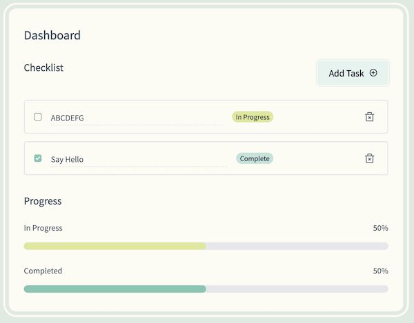

# SvelteKit + TailwindCSS: Todo App 만들기

[Build the Ultimate Todo App with SvelteKit and Tailwind CSS](https://www.youtube.com/watch?v=3MCpUaboF18&list=WL&index=181)를 따라한 클론 프로젝트입니다.

## 1. 개요

### Features

- [x] SvelteKit
- [x] TailwindCSS

### Screenshots



### 원본과 다른 점

- `TodoStore.ts` : type Todo 를 만들어 js 파일을 ts 로 변환
  - ts 에서 uuid 사용을 위해 `pnpm i --save-dev @types/uuid`
  - todos store 갱신을 위해 slice 이용한 object array 재생성으로 변환
    - 안하면 state 및 progressBar 변경이 안된다
- `TodoInput.svelte` 에서 completed 속성을 생성해 변경 감시를 하도록 했음
  - toggle 적용을 위해 상태 변경이 일어나는 변수가 필요함
  - `on:input` 바인딩에 사용된 event 에 대해 `@ts-ignore` 적용
    - ts-lint 가 적용되어 빨간줄이 생긴다 (신경쓰임)

## 2. 프로젝트 설정

### [SvelteKit](https://kit.svelte.dev/) 프로젝트 생성

```bash
pnpm create svelte@latest svltk-tailwind-todo-app
  - Skeleton project
  - TypeScript

cd svltk-tailwind-todo-app
pnpm install

pnpm run dev
```

### [TailwindCSS 설정](https://tailwindcss.com/docs/guides/sveltekit)

1. Install TailwindCSS
2. `tailwind.config.js` 에 template paths 추가
3. `app.css` 에 Tailwind directives 추가
4. 최상위 `+layout.svelte` 에 `app.css` import
5. `+page.svelte` 에서 TailwindCSS classes 를 사용해 작동 확인

```bash
pnpm install -D tailwindcss postcss autoprefixer
pnpx tailwindcss init -p

pnpm run dev
```

```js
// tailwind.config.js
/** @type {import('tailwindcss').Config} */
export default {
  content: ['./src/**/*.{html,js,svelte,ts}'],
  theme: {
    extend: {},
  },
  plugins: [],
};
```

```css
/* src/app.css */
@tailwind base;
@tailwind components;
@tailwind utilities;
```

```html
<!-- src/routes/+layout.svelte -->
<script lang="ts">
  import '../app.css';
</script>

<slot />
```

```html
<!-- src/routes/+page.svelte -->
<h1 class="text-3xl font-bold underline">Hello, SvelteKit!</h1>
```

### TailwindCSS 내장 플러그인 사용

#### [Typography](https://tailwindcss.com/docs/typography-plugin) and [Forms](https://github.com/tailwindlabs/tailwindcss-forms)

```bash
pnpm install -D @tailwindcss/typography
pnpm install -D @tailwindcss/forms
```

```js
// tailwind.config.js
/** @type {import('tailwindcss').Config} */
export default {
  content: ['./src/**/*.{html,js,svelte,ts}'],
  theme: {
    extend: {},
  },
  plugins: [require('@tailwindcss/typography'), require('@tailwindcss/forms')],
};
```

#### Tailwind [Nesting](https://tailwindcss.com/docs/using-with-preprocessors#nesting)

```js
// postcss.config.js
export default {
  plugins: {
    'postcss-import': {},
    'tailwindcss/nesting': {},
    tailwindcss: {},
    autoprefixer: {},
  },
};
```

## 3. 코딩

### 프로젝트 구조

```txt
src
├── app.html
├── app.d.ts
├── app.css
├── lib
│   ├── index.ts
│   └── components
│       ├── progress
│       │   ├── ProgressBar.svelte      # 컴포넌트
│       │   └── ProgressSection.svelte  # 컴포넌트
│       ├── todo
│       │   ├── AddTodoSection.svelte   # 컴포넌트
│       │   ├── TodoInput.svelte        # 컴포넌트
│       │   └── TodoSection.svelte      # 컴포넌트
│       ├── stores
│       │   └── TodoStore.ts
│       └── types
│           └── Todo.ts
├── routes
│   ├── +layout.svelte
│   └── +page.svelte
```

### 상세내용은 코드 참조

#### `+page.svelte`

```html
<script lang="ts">
  import AddTodoSection from '$lib/components/todo/AddTodoSection.svelte';
  import TodoSection from '$lib/components/todo/TodoSection.svelte';
  import ProgressSection from '$lib/components/progress/ProgressSection.svelte';
</script>

<div
  class="min-h-screen bg-olive-one p-0 selection:bg-green-two md:py-24 md:px-8"
>
  <main
    class="mx-auto min-h-screen max-w-none rounded-none bg-cream-four px-5 py-10 outline-none md:min-h-max md:max-w-[60rem] md:rounded-2xl md:px-8 md:outline md:outline-4 md:outline-offset-8 md:outline-cream-four"
  >
    <h1 class="text-2xl font-bold text-gray-three">Dashboard</h1>
    <div class="mt-10">
      <AddTodoSection />
      <TodoSection />
      <ProgressSection />
    </div>
  </main>
</div>
```

#### object array 변경

```ts
export const todos = writable(data);

export const toggleComplete = (id: string) => {
  todos.update((currentTodos: Todo[]) => {
    const index = currentTodos.findIndex((todo) => {
      return todo.id === id;
    });
    console.log('index:', index);
    if (index !== -1) {
      const updatedTodo = {
        ...currentTodos[index],
        completed: !currentTodos[index].completed,
      };
      console.log('updatedTodo:', updatedTodo);
      // 새로운 배열을 생성해야 store 갱신이 처리됨
      return [
        ...currentTodos.slice(0, index),
        updatedTodo,
        ...currentTodos.slice(index + 1),
      ];
    }
    return currentTodos;
  });
};
```

&nbsp; <br />
&nbsp; <br />

> **끝!**
